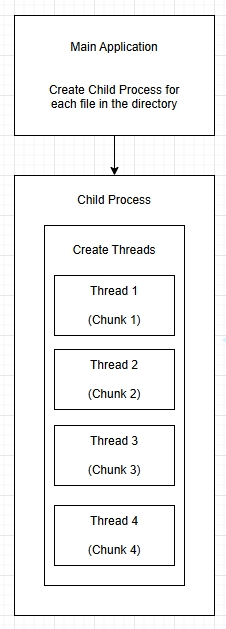
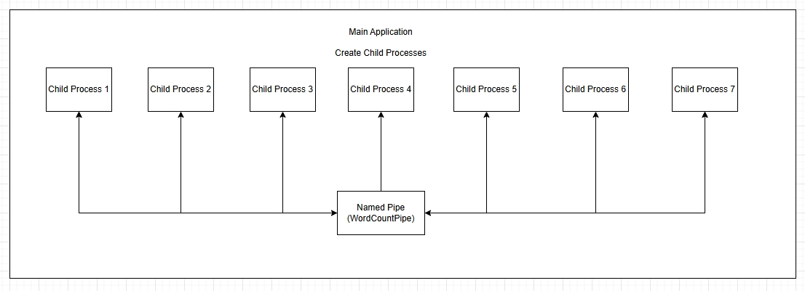
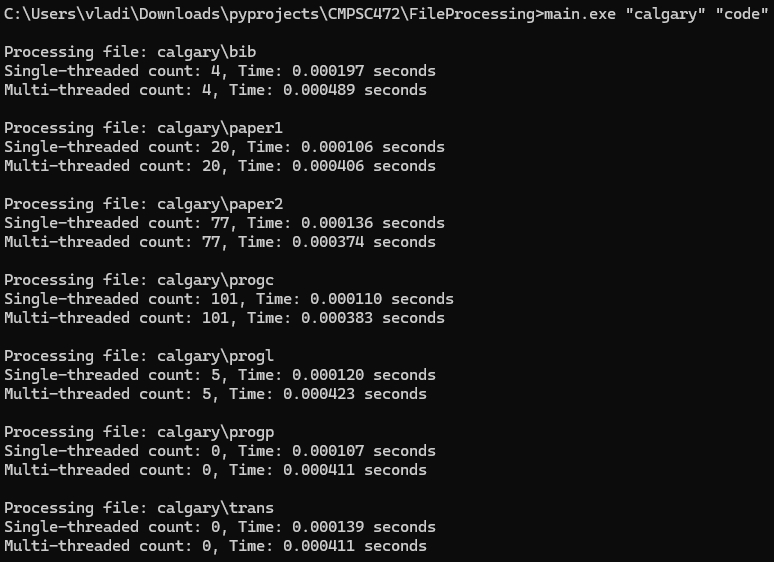

# File Processing with Multiprocessing and Multithreading

## Description of the Project

This project implements a word counting tool that can process multiple files located in a specified directory. It uses both multithreading and multiprocessing techniques to improve performance by parallelizing the counting of word occurrences in the files.

## Overview of How Multiprocessing and Multithreading are Used

-   **Multiprocessing**: The main application creates a separate child process for each file in the specified directory. Each child process is responsible for counting the occurrences of a specified word in its assigned file. This approach allows for isolation between the processing of different files, as each child process operates in its own memory space.

-   **Multithreading**: Within each child process, multiple threads are spawned to count word occurrences in different chunks of the file's content. This further speeds up the counting process by utilizing multiple CPU cores to handle different sections of the file simultaneously.

## Advantages and Disadvantages

### Advantages

-   **Multiprocessing**:

    -   Provides isolation, improving stability (one process crashing does not affect others).
    -   Utilizes multiple CPUs effectively.

-   **Multithreading**:
    -   Lower overhead compared to creating processes, allowing for faster context switching.
    -   Easier data sharing through shared memory.

### Disadvantages

-   **Multiprocessing**:

    -   Higher overhead for process creation and management.
    -   More complex inter-process communication (IPC) required.

-   **Multithreading**:
    -   Increased complexity in managing shared resources and potential race conditions.
    -   Requires careful synchronization to avoid data corruption.

## Structure of the Code

The code is structured to handle word counting via a main function that orchestrates the processing of files. It consists of several key functions:

1. **count_word_in_chunk**: Counts occurrences of a specified word in a given buffer.
2. **process_file_single_thread**: Reads a file and counts occurrences in a single-threaded manner.
3. **process_file_in_threads**: Spawns multiple threads to count word occurrences in parallel.
4. **create_child_process**: Creates a new process for each file.
5. **process_directory**: Processes each file in the specified directory.

### Diagrams

-   **Process and Thread Creation**
    

-   **Inter-Process Communication**
    

## Implementation Details

### Process Management

The main application uses the Windows API to create child processes, each handling the counting of words in a file. The parent process is responsible for creating these child processes and waiting for their completion.

### IPC Mechanism

-   **Pipes**: Named pipes (e.g., `\\.\pipe\WordCountPipe`) can be used for communication between the parent and child processes if needed.

### Threading

Threads are created within each child process to allow parallel processing of file contents. Each thread operates on a different chunk of the file, counting occurrences of the specified word.

### Error Handling

The application checks for errors when opening files, creating processes, and creating threads. It logs error messages to the console when issues arise.

## Performance Evaluation

Performance is evaluated by comparing the execution time and word count results of the single-threaded and multi-threaded approaches.

### Instructions

To run the system:

1. **Clone the Repository:**

```bash
git clone https://github.com/VadimG0/FileProcessing.git
cd stock-analyzer
```

2. **Compile the Code:** Ensure you have a suitable C/C++ compiler set up with the Windows API.
3. **Run the Application:** Execute the application from the command line, providing a directory and the word to count as arguments.

```bash
main.exe "calgary" <word>
```

## Performance Evaluation

### Examples

-   **Example where frequency of the word "code" is counted:**
    

## Discussion

### Challenges Faced

-   **Concurrency Issues:** Managing shared resources between threads required careful synchronization to prevent data races.
-   **Performance Tuning:** Determining the optimal number of threads based on file size and content characteristics was a challenge.

### Observed Pros and Cons

-   **Multiprocessing Pros:** Improved reliability and resource isolation. Suitable for CPU-bound tasks.
-   **Multithreading Pros:** Faster execution times for I/O-bound tasks due to reduced overhead.

### Limitations and Possible Improvements

-   **Limitations:** The current implementation uses a fixed number of threads; dynamic thread allocation based on file size could enhance performance further.
-   **Improvements:** Consider adding logging features for better monitoring and debugging, and optimizing IPC mechanisms for better communication efficiency.
